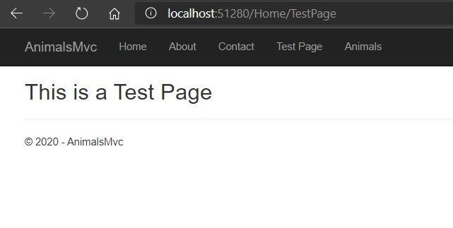
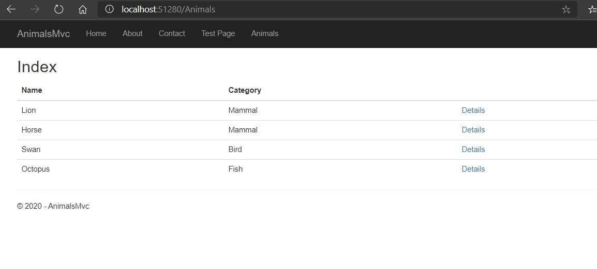
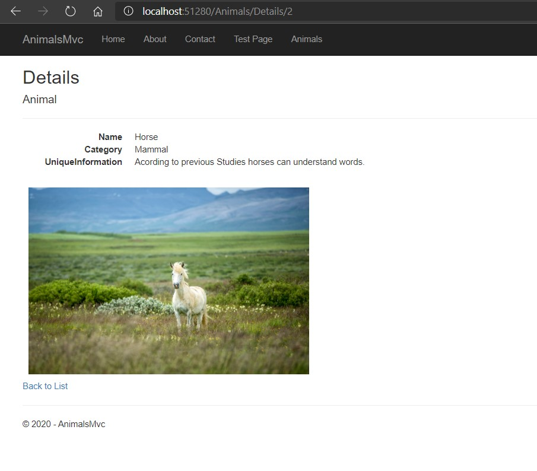

# Module 1: Exploring ASP.NET Core MVC

## Lab: Exploring ASP.NET Core MVC

1. **Nombres y apellidos:** Francisco Javier Moreno Quevedo
2. **Fecha:** 06/12/2020
3. **Resumen del Ejercicio:**  Crear un proyecto Net core Web Application MVC comprenderlo y añadir una funcionalidad
4. **Dificultad o problemas presentados y como se resolvieron:** Ninguna

- Ejercicio 3: Exploring an MVC Application

  - Creamos un nuevo proyecto **ASP.NET Core Web Application MVC**
  
  - Añadimos la accion TestPage en el **HomeController**
  
- Creamos la vista **TestPage **correspondiente a esta accion 
  
  - Añadimos en el **_Layout.cshtml** la entrada del menu para la TestPage
  
  - Añadimos la clase **Animal.cs** con sus propiedades dentro de Models
  
- Creamos el Interface **IData.cs**
  
- Añadimos la clase existente **Data.cs**
  
- Añadimos la clase **IndexViewModel.cs** con la lista de animales
  
- Añadimos el controlador **AnimalsController.cs** con dos acciones Index y Details
  
- Creamos una vista de cada accion
  
- Añadimos en el **_Layout.cshtml** la entrada del menu para ver los Animales
  
- En el middleware inyectamos las dependencias de IData
  
- Ejecutamos:
  
  
  
- 
  
  
  
  - 
  
    
  
  - 
